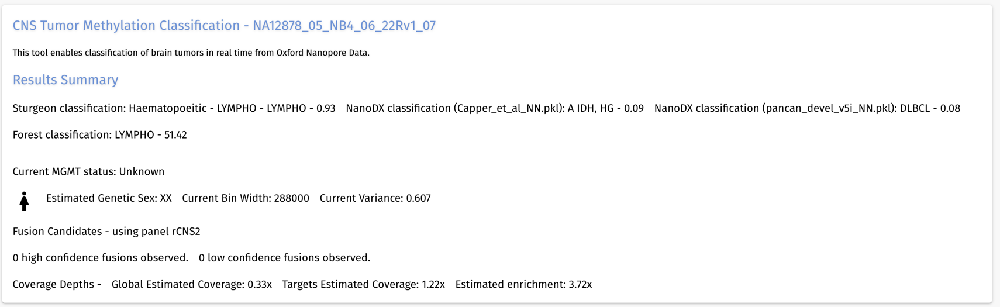
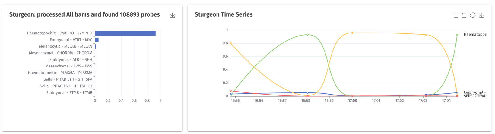
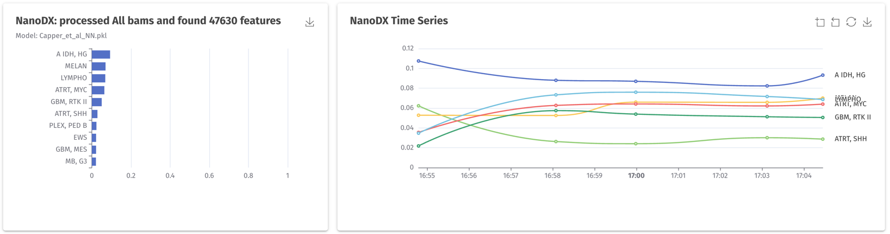
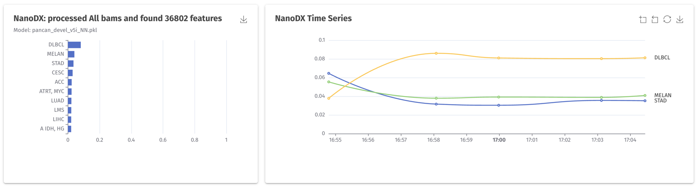
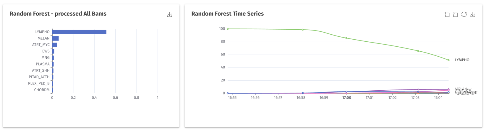
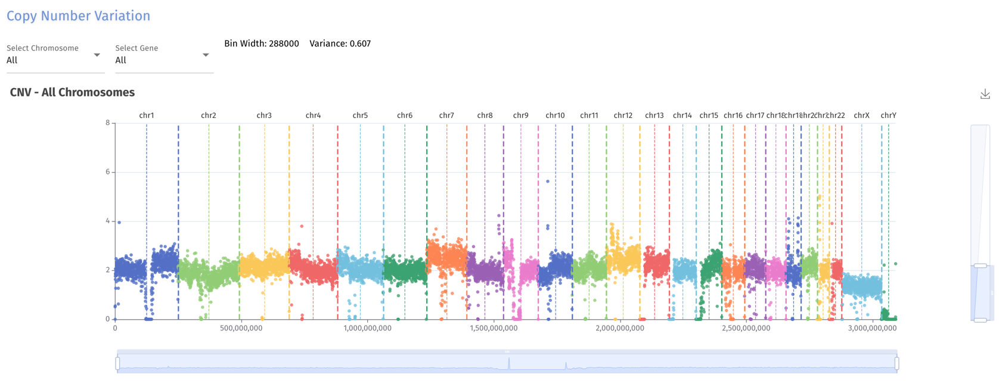
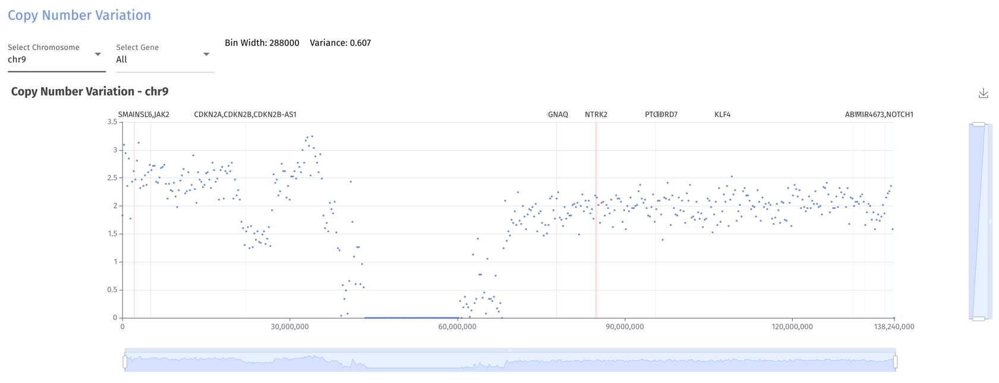
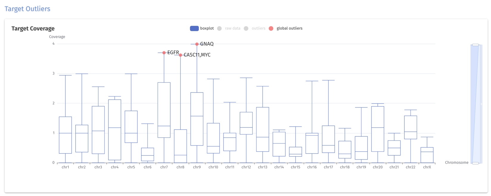

#  ROBIN
-----
## Test Data Set A

This data set is provided for users to test the ROBIN tool for rapid diagnostics from Nanopore data. ROBIN is available from https://github.com/LooseLab/ROBIN and is required for analysis of these data.

The bam files contained within the test_data_set folder are derived from a barcoded sample set with reads from three cell lines, NA12878, NB4 and 22Rv1. The reads were base called with dorado version 0.8 using the HAC model with 5mC 5hmC calling. The reads are mapped to hg38 with no alts and no unplaced sequences. 

These reads are provided solely for the purpose of testing a ROBIN installation on a small data set. They will not result in a "valid" or meaningful classification with respect to CNS tumours.

<strong>These are not patient derived reads.</strong>

## Usage

Please download this repo:

```commandline
git clone https://github.com/LooseLab/ROBIN_test_set_A
```

Then configure and run ROBIN as in the ROBIN repository, but for the watch directory (-w) point ROBIN to the ROBIN_test_set_A/test_data_set folder.

## Expected Results

Below are typical screenshots that you should see if using this data set.

### Summary Classification



### Methylation Results









### CNV Results



Specific chromosome 9 example:




### Target Coverage




*** Please note - no SNP calls should be generated from this data set as no individual targets cross the threshold for calling.

### MGMT and Fusions

No reads cover the MGMT promoter in this test data set, nor are any fusions present. So these reports should be negative.

### Example sample report.

An example sample report is available here:

[NA12878_05_NB4_06_22Rv1_07_run_report.pdf](resources/NA12878_05_NB4_06_22Rv1_07_run_report.pdf)


